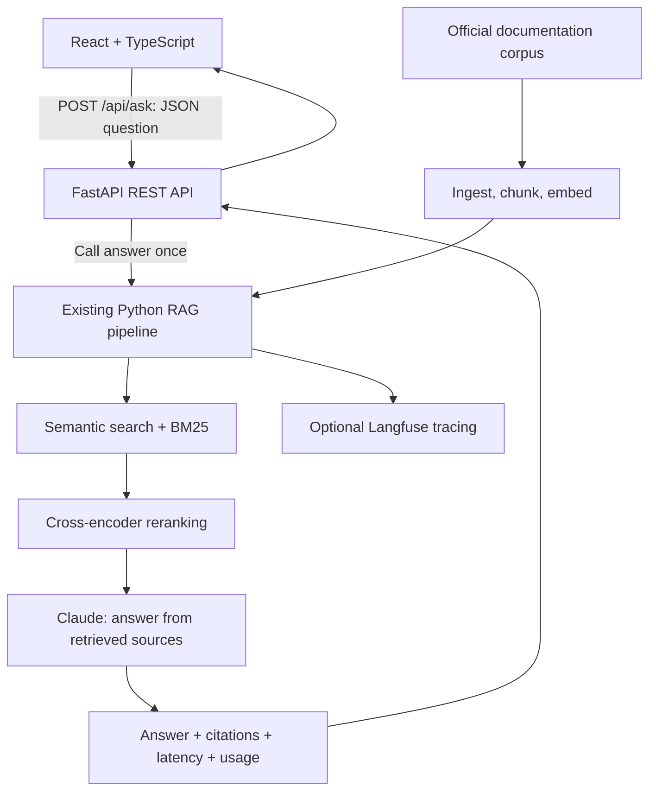

# Consumer Technology Support Assistant

A React and TypeScript interface for a Python retrieval-augmented generation (RAG) assistant. Ask about consumer audio products and receive an answer grounded in official documentation, numbered citations, source links, token usage, and measured response latency.


## Scope

The application covers **4 products, 26 documents, and 53 chunks**:

| Product | Documents | Coverage examples |
| --- | ---: | --- |
| Sony WH-1000XM5 | 8 | Pairing, troubleshooting, charging, reset, controls, specifications |
| AirPods Pro 2 (USB-C) | 7 | Connection troubleshooting, pairing, charging, Find My, noise control, specifications |
| Google Pixel Buds Pro 2 | 6 | Setup, specifications, controls, noise control, reset, audio troubleshooting |
| Bose QuietComfort Ultra Headphones | 5 | Pairing, charging, listening modes, connection issues, no audio |

Source text is curated from official manufacturer pages under `data/raw/`. Each product's `_meta.json` records the URL, product, title, category, and filename. These are excerpts or summaries, not complete manuals. All 26 source URLs were checked successfully during expansion verification.

This is a portfolio-scale support prototype. It cannot access accounts, control devices, make purchases, or decide warranty eligibility. It is instructed to refuse unsupported questions and ask which product the user means when necessary. Retrieval and generated answers can still be wrong or incomplete; verify them against the linked manufacturer sources.

## Architecture



The API stays separate from `src/`: it validates HTTP input, calls the existing `answer()` function, maps its output to JSON, handles errors, and measures total time. The same pipeline remains usable from the CLI and evaluation scripts. The health endpoint does not load retrieval models or call Claude.

Embeddings use `all-MiniLM-L6-v2`; reranking uses `cross-encoder/ms-marco-MiniLM-L-6-v2`. Vectors are stored in generated JSON files and searched locally with NumPy, not a hosted vector database. Models are cached within each Python process after their first load.

## Local setup

Use Python 3.11 or later, Node.js 22.12 or later, and pnpm. This expansion was verified with Python 3.12 and Node.js 24.19.

From the repository root, create a virtual environment. Same command on both platforms (use `python` if your Windows installation does not provide `python3`):

```sh
python3 -m venv .venv
```

Activate it:

```sh
# Mac / Linux
source .venv/bin/activate
# Windows PowerShell
.venv\Scripts\Activate.ps1
```

Install dependencies and rebuild generated data. Same commands on both after activation:

```sh
python -m pip install -r requirements.txt
python -m src.ingest
python -m src.chunk
python -m src.embed
```

The first model download needs internet access. `data/processed/` is ignored by Git and must be rebuilt on a fresh checkout.

Create `.env` at the repository root:

```dotenv
ANTHROPIC_API_KEY=your-key
# Optional tracing: use your Langfuse project's region and credentials.
LANGFUSE_PUBLIC_KEY=your-public-key
LANGFUSE_SECRET_KEY=your-secret-key
LANGFUSE_BASE_URL=https://us.cloud.langfuse.com
```

Provider credentials stay in Python. Never put provider keys in the frontend or a `VITE_` variable. When configured, Langfuse receives question/answer traces, stage timing, and token usage; use non-sensitive demonstration questions.

Start the backend from the root. Same command on both:

```sh
python -m uvicorn api.main:app --host 127.0.0.1 --port 8000
```

In a second terminal, start the frontend. Same commands on both:

```sh
cd frontend
pnpm install --frozen-lockfile
pnpm dev --host 127.0.0.1
```

Open **http://localhost:5173**. CORS permits that exact origin, not `http://127.0.0.1:5173`. Keep port 5173 available so Vite does not switch ports. The API is at **http://localhost:8000**, with interactive documentation at **http://localhost:8000/docs**.

Optional public configuration in `frontend/.env.local`: `VITE_API_BASE_URL=http://localhost:8000`. See `frontend/.env.example`. Restart Vite after changing it. Deliberately update the CORS allowlist if using a different frontend origin.

The original CLI remains available from the root:

```sh
python -m src.cli
```

## REST API

`GET /api/health` returns `{"status":"ok"}`. `POST /api/ask` accepts:

```json
{"question":"What Bluetooth version do Pixel Buds Pro 2 use?"}
```

The question must be a string, trimmed, and between 1 and 1,000 characters. Example response shape below: timing and token numbers are illustrative, not a benchmark. Source numbers are preserved from the pipeline and need not be consecutive when only some passages were cited.

```json
{
  "answer": "The Pixel Buds Pro 2 use Bluetooth 5.4 [1].",
  "sources": [{
    "number": 1,
    "product": "Google Pixel Buds Pro 2",
    "title": "Google Pixel Buds requirements and specifications",
    "url": "https://support.google.com/googlepixelbuds/answer/7544332"
  }],
  "latency": {"retrieve_ms": 50, "rerank_ms": 55, "generate_ms": 650, "total_ms": 770},
  "usage": {"input_tokens": 637, "output_tokens": 24}
}
```

Total time uses a monotonic timer around API processing. It includes overhead beyond the three stages but excludes browser/network transit. The pipeline is not rerun to calculate timings. Refusals and clarification requests can return an empty `sources` array.

## Loading and failures

The UI clears stale answers, preserves the submitted question, shows a loading message, and disables repeated submissions. It renders plain text, safe external source links, and backend measurements. Labels, status/error announcements, keyboard support, and visible focus are included.

Empty input is rejected before sending. The browser aborts after 30 seconds and offers Retry using the last valid question. Messages distinguish network, timeout, validation, server, and malformed-response failures. A browser abort does not cancel an already-running Python/Claude call, so retries may still incur costs.

Backend errors return safe JSON `detail` messages: validation is 422; missing corpus/key is 503; provider connection/status failure is 502; provider timeout is 504; unexpected errors are 500. Detailed exceptions remain in backend logs.

## Tests and evaluation

From the root with the virtual environment active. Same commands on both:

```sh
python -m pytest tests/ -q
python -m pytest evals/test_retrieval_quality.py -q
python -m evals.report_expansion
# Live Claude calls, billable, requires ANTHROPIC_API_KEY:
python -m pytest evals/test_citations.py -q
```

Unit/API tests mock generation; retrieval checks run local models. Run live evaluations separately from `tests/` so its fixture disabling Langfuse for mock calls does not also disable live tracing.

From `frontend/`, same commands on both:

```sh
pnpm test
pnpm build
pnpm lint
```

Tests cover validation, loading, answers, sources, latency, refusal rendering, errors, malformed responses, timeout, and retry. See [verification notes](docs/full-stack-verification.md) for observed outcomes and limitations.

## Retrieval results

The original baseline had 4 documents, 9 chunks, and 28 questions. Before expansion, 34 unit tests and 4 live citation checks passed, and the CLI worked. Baseline semantic hit/MRR was 1.0000/0.9048; hybrid and reranked results were 1.0000/0.9643 at alpha 0.6.

The expanded development set contains **56 retrieval questions**, plus **8 refusal cases** and a product-clarification case for generation checks. The following metrics use only the 56 retrieval questions:

| Method | hit_rate@3 | mrr@3 |
| --- | ---: | ---: |
| Semantic | 0.9107 | 0.7649 |
| Hybrid, alpha 0.95 | 0.9107 | 0.7708 |
| Hybrid + reranking | 0.9286 | 0.7738 |

Hit rate checks whether the labeled document appears in the first three chunks. MRR rewards earlier placement. [Saved per-question results](docs/evaluation-results.json) contain every returned document ID and rank; regenerate them with `python -m evals.report_expansion`.

An alpha sweep from 0.3 to 1.0 favored 0.95 on this development set: repeated vocabulary across products made a large keyword contribution noisy. Reranking adds one hit out of 56 and a small MRR gain, with extra latency. These are development-set measurements, not held-out accuracy. Old and new aggregate scores use different corpora and question sets.

The relevance cutoff remains 0.15 after spot checks: supported questions scored about 0.83 and 0.68, while two unrelated questions scored about 0.05 and 0.14. Unsupported product/policy questions can exceed the cutoff, so generation must still enforce the source boundary.

## Known limitations and tradeoffs

- Short queries such as `AirPlay button Control Center` and `status light flashes white` still miss the expected evidence. A broad AirPods troubleshooting phrasing was refused in browser testing despite relevant corpus material. This is a support-quality failure, not a successful answer.
- Labels accept one document per question. Added sources sometimes overlap, so some misses may be alternate relevant documents. Inherited ambiguous/misleading questions need an independent annotation review before stronger accuracy claims.
- Multiple chunks from one document may occupy the shortlist, and citations may link to one page more than once. Retrieval hit rate does not prove every generated claim is correct.
- Generation is nondeterministic. Citation tests check product/source behavior, not all factual claims. There is no conversation memory: include the product in each new question.
- Cold model loading is slower. The browser timeout can precede upstream completion. Production use would require cancellation, concurrency limits, authentication, rate limiting, and deployment-specific CORS.
- Sources are maintained manually. No scraping scheduler, production deployment, persistent accounts, or hosted vector database is included.

## Docker and project history

The existing Dockerfile remains a **CLI-only** image. It builds corpus data at image build time and takes secrets at runtime. It was not rebuilt during full-stack verification and does not serve the React/FastAPI app.

```sh
docker build -t consumer-tech-support-assistant .
docker run --env-file .env -it consumer-tech-support-assistant
```

[PORTFOLIO.md](PORTFOLIO.md) and [PROJECT_BRIEF.md](PROJECT_BRIEF.md) describe the original RAG project and may contain its earlier scope/results. This README and `docs/` describe the expansion. Independent skill mastery was not assessed: learning checkpoints were skipped at the owner's request.
